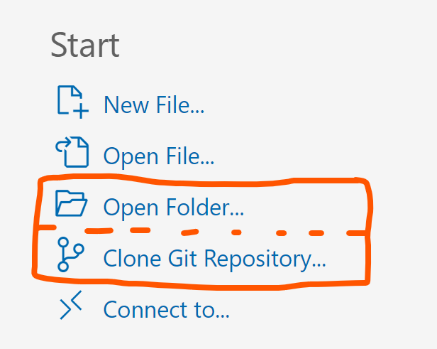
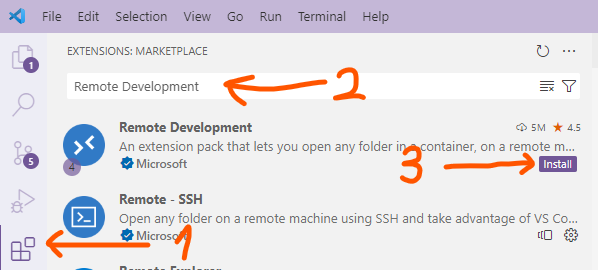
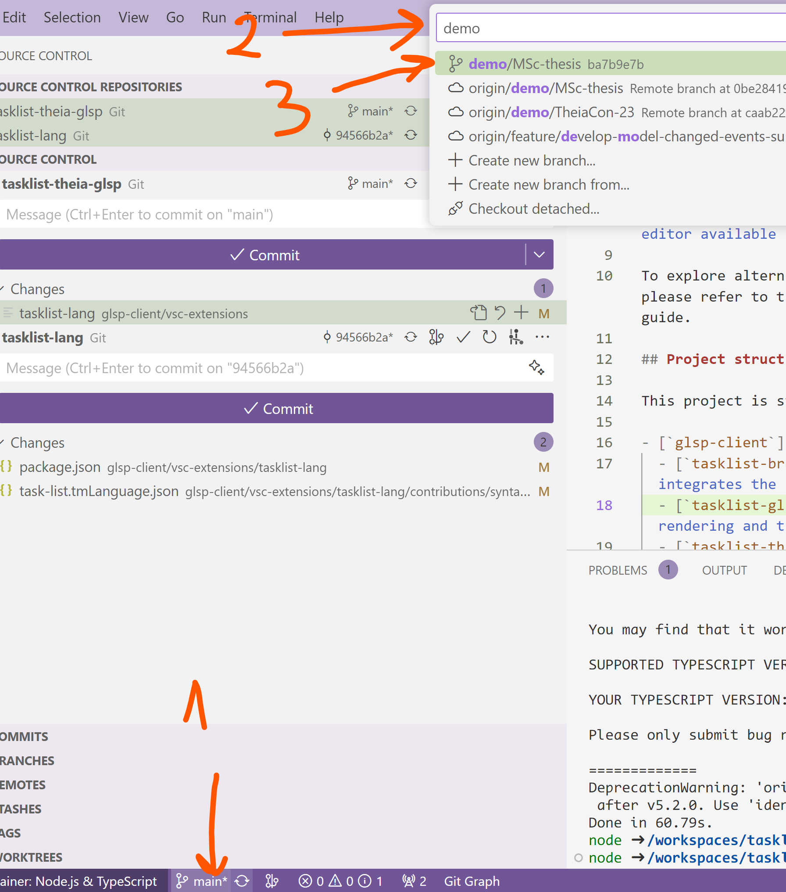
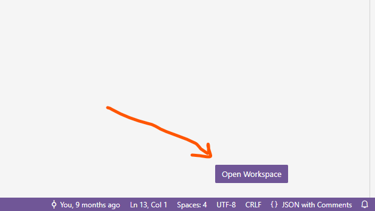
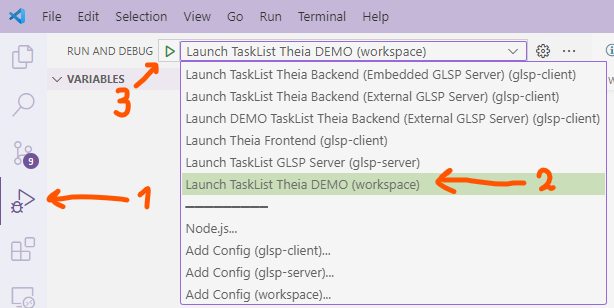
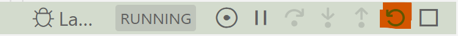

# Langium Model Server PoC

This repository contains the source code to build and demonstrate the work of Langium Model Server (LMS) within the example of `tasklist` visual and textual languages.

## Prerequisities

The most easy way to get started is to open the repository with VSCode and launch it from the Devcontainer:

### Tools to have installed on the PC before building and starting the project

1. [Git for Windows](https://git-scm.com/download/win);
1. [VSCode IDE](https://code.visualstudio.com/download);
1. [Docker Desktop for Windows](https://docs.docker.com/desktop/install/windows-install/).

### Opening this project in VSCode IDE

1. Launch Docker Desktop and VSCode
2. In VSCode open the project as a folder by either :
  - Selecting "Open Folder" on the Starting screen of VSCode and navigating to the directory with cloned tasklist-theia-glsp repository (if you cloned it already from the GitHub)
  - Selecting "Clone Git Repository" on the Starting screen of VSCode and paste this link: 'https://github.com/Crystal-Modeling/tasklist-theia-glsp.git'
3. Once the project is opened, install "Remote Development" extension pack by pressing "Ctrl+Shift+X" and typing "Remote Development" and clicking "Install" on the first search result 
4. Next, reopen project from the Devcontainer, cloning the repository to the Docker volume:
  - Hit "Ctrl+Shift+P" to open VSCode command pallete
  - Enter "clone repository in container volume" into the pallete prompt
  - Click on "Dev Containers: Clone repository in container volume..." to execute command
5. Wait until the project is opened, then switch to `demo/MSc-thesis` Git branch using the indicator on bottom-left 

## Launching the example

Open new embedded terminal (Ctrl+Shift+`) and execute the following commands:

1. Initialize & update submodule for tasklist-lang

```bash
git submodule init
git submodule update
```

2. Build all the components

```bash
yarn build
```

3. Open project workspace (in the container) to make launch configs available in the IDE 
  - Open workspace file [tasklist-theia-glsp.code-workspace](tasklist-theia-glsp.code-workspace)
  - Click "Open Workspace" in the top bottom corner

4. Launch Theia with tasklist-lang extension and GLSP server 
  - Open Run and Debug view (Ctrl+Shift+D)
  - In the dropdown on the bottom-left select "Launch Tasklist Theia DEMO (workspace)" launch config
  - Press green triangular on the dropdown left
  - Upon this "localhost:3000" should get opened in your browser with Theia IDE UI loaded.

## Demoing the example

The following demonstration has been presented at the [TheiaCon 2023](https://events.eclipse.org/2023/theiacon/). You can find the session recording [here](https://www.youtube.com/watch?v=MktROv0bdwk).

LMS demonstrates an approach to use textual language as a source model for the diagrams.
This approach enables editing the language models equally either by editing the model in text (as a textual code), or visually (on a diagram).
This serves as a basis for modern open-source Low-code platforms, suggesting a technology to be used in platform IDE to add support for heterogeneous interactions with the model.

### TEXT EDITING (With diagram updates)

Technology, which enables rich editing capabilities for a textual editor (autocompletion, code actions, renaming, and language validation) is called Language Server.

1. Create Files:
   - new file 'shopping.tasks'
   - Having 'shopping.tasks' in focus, create new file 'shopping.tasklist'. Move it to the right-side pane.
2. Demonstrate LSP capabilities:

   - Autocomplete (type the first task: `task 1 "Fruits"`)
   - Code Actions (typing ` -> next` and pressing Enter), modifying the tasks model to

   ```tasklist
   task 1 "Fruits" -> vegs
   task vegs "Vegetables"
   ```

   - Rename handler (pressing Fn+F2 on `vegs` task name and renaming it to `2` to be consize):

   ```tasklist
   task 1 "Fruits" -> 2
   task 2 "Vegetables"
   ```

3. Demonstrate selection sync: Click on different text nodes (e.g., `1`, then `2`) in 'shopping.tasks' on the left (watch how different nodes on the diagram get centered)
4. Demonstrate saving sync: Save 'shopping.tasks' (watch 'shopping.tasklist' gets saved automatically)
5. Demonstrate invalid models are not exposed (not digested to the diagram server) by replacing the content of the editor with the following:

   ```tasklist
   task 1 "Fruits" -> 2, 2
   task 1 "Fruits again"
   task 2 "Vegetables" -> 3
   task "No name"
   ```

   Those ☝️ are both:

   - model (semantic?) errors, when there is a duplicate task (1) or transition (1->2)
   - language (parsing, linking) errors, when a reference to a task is not resolved (3->4) or a task doesn't have a name (the last task)

6. Restore the editor content (Hit Ctrl+Z).

### DIAGRAM EDITING (With source model updates in the text editor)

Langium Model Server brings extra advantages: rich _editing_ of the model from the diagram side.

7. Switch off diagram autolayouting:

   - Open IDE Command Pallete (Ctrl+Shift+P)
   - Enter 'Disable GLSP diagram autolayouting' into the pallete input and hit Enter to execute command

8. Demonstrate Tasks and Transitions creation, editing, and deletion:

   - Create new Task to the left of Task 1 (watch it is created between tasks 1 and 2 in 'shopping.tasks')
   - Create another Task somewhere on the bottom (watch it is created at the end with the name "taskName_2")
   - Create new Transition from Task 1 to taskName
   - Update "taskName" name to "oranges" and content to "Red oranges" (watch corresponding updates in 'shopping.tasks')
   - Edit Task taskName_2 content, it to to "Potatoes" (watch it is updated in 'shopping.tasks')
   - Create new Transition from Task oranges to taskName_2 (let's say we made a mistake)
   - Update "taskName_2" name to "potatoes"
   - Change the sourceTask for Transition oranges->potatoes (2->potatoes)
   - Attempt to create new Transition with duplicate name (watch it was not added to the model)
   - Demonstrate models deletion: add couple of more tasks, and transitions, and then delete everything apart from:

   ```tasklist
   task 1 "Fruits" -> 2, oranges
   task oranges "Red oranges"
   task 2 "Vegetables" -> potatoes
   task potatoes "Potatoes"
   ```

9. Demonstrate saving sync: Save the diagram (watch 'shopping.tasks' is also saved)

### LMS MODEL VALIDATION

10. Demonstrate LSP validation (switch to the Problems tab in the bottom panel)

   - Modify 'shopping.tasks' to:

   ```tasklist
   task 1 "Fruits" -> 2, oranges
   task oranges "Red oranges" -> lemons
   task lemons "zesty lemons"
   task 2 "Vegetables" -> potatoes
   task potatoes "Potatoes" -> potatoes
   ```

   - Watch the language errors: task lemons has lowercased content, and task potatoes references itself

11. Demonstrate how GLSP diagram consumes LSP validation by using LMS validation endpoint:
   - Click 'Validate model' button on GLSP diagram pallete -- watch the validation markers (❕and ❌ appear on the invalid Task nodes and Transition edge), which, when hovered, displays exactly the same validation message, as the one observable in the LSP text editor.

## Version compatibility

The following libraries/frameworks need to be installed on your system:

- [Node.js](https://nodejs.org/en/) `>=14.18.0`
- [Yarn](https://classic.yarnpkg.com/en/docs/install#debian-stable) `>=1.7.0`

The examples are heavily interweaved with Eclipse Theia, so please also check the [prerequisites of Theia](https://github.com/eclipse-theia/theia/blob/master/doc/Developing.md#prerequisites).

### Theia Version compatibility

This project template is compatible with Theia `>=1.37.2`.

## VS Code workspace

To work with the source code and debug the example in VS Code a dedicated [VS Code Workspace](node-json-theia.code-workspace) is provided.
The workspace includes both the `glsp-client` and `glsp-server` sources and offers dedicated launch configurations to run and debug the example application.

To open the workspace start a VS Code instance and use the `Open Workspace from File..` entry from the `File` menu.
Then navigate to the directory containing the workspace file and open the `node-json-theia.code-workspace` file.

For a smooth development experience we recommend a set of useful VS Code extensions. When the workspace is first opened VS Code will ask you wether you want to install those recommended extensions.
Alternatively, you can also open the `Extension View` (Ctrl + Shift + X) and type `@recommended` into the search field to see the list of `Workspace Recommendations`.

## Project structure

This project is structured as follows:

- [`glsp-client`](glsp-client)
  - [`tasklist-browser-app`](glsp-client/tasklist-browser-app): browser client application that integrates the basic Theia plugins and the tasklist specific glsp plugins
  - [`tasklist-glsp`](glsp-client/tasklist-glsp): diagram client configuring the views for rendering and the user interface modules
  - [`tasklist-theia`](glsp-client/tasklist-theia): glue code for integrating the editor into Theia
  - [`workspace`](glsp-client/workspace): contains an example file that can be opened with this diagram editor
  - [`vsc-extensions/tasklist-lang`](glsp-client/vsc-extensions/tasklist-lang): Git Submodule, fetching tasklist-lang repository with VSCode extension for TaskList Langium Language Server (with Langium Model Server 'extension')
- [`glsp-server`](glsp-server)
  - [`src/diagram`](glsp-server/src/diagram): dependency injection module of the server and diagram configuration
  - [`src/handler`](glsp-server/src/handler): handlers for the diagram-specific actions
  - [`src/model`](glsp-server/src/model): all source model, graphical model and model state related files

The most important entry points are:

- [`glsp-client/tasklist-glsp/src/di.config.ts`](glsp-client/tasklist-glsp/src/di.config.ts): dependency injection module of the client
- [`glsp-client/tasklist-browser-app/package.json`](glsp-client/tasklist-browser-app/package.json): Theia browser application definition
- [`glsp-server/src/diagram/tasklist-diagram-module.ts`](glsp-server/src/diagram/tasklist-diagram-module.ts): dependency injection module of the server

## Running the example

To start the Theia browser application with the integrated tasklist example, navigate to the client directory

```bash
cd glsp-client
```

and then execute:

```bash
yarn start
```

This will launch the example in the browser with an embedded GLSP server on [localhost:3000](http://localhost:3000).

❗ You should only run Theia from Chrome browser! Firefox fails to render some features, apparently.

### Debugging the project

To debug the involved components, the [VS Code workspace](node-json-theia.code-workspace) offers launch configs, available in the `Run and Debug` view (Ctrl + Shift + D). They are listed in the next section.

In order to develop GLSP server component, the following running procedure has been identified as the best:

1. Run glsp-server compilation in watch mode (`yarn watch` from glsp-server directory)
2. Run both Theia backend and GLSP server using "Launch TaskList Theia backed with external GLSP Server" launch config
3. Open [localhost:3000](http://localhost:3000) in Chrome browser
4. Whenever you want to see new changes propagated to the running instance:
   1. Close GLSP client (a tab with GLSP diagrams in Theia running application)
   2. Reload GLSP server process from Call Stack panel in VSCode 
   3. Reload Theia client by reloading the browser tab

### Launch configuration

Here you can choose between four different launch configurations:

- `Launch TaskList GLSP Server`<br>
  This config can be used to manually launch the `TaskList GLSP Server` node process.
  Breakpoints in the source files of the `glsp-server` directory will be picked up.
  In order to use this config, the Theia application backend has to be launched in `External` server mode (see `Launch TaskList Theia Backend (External GLSP Server)`).
- `Launch TaskList Theia Backend (External GLSP Server)`<br>
  This config launches the Theia browser backend application but does not start the GLSP server as embedded process.
  Breakpoints in the source files of the `glsp-client/**/node` directories will be picked up.
  It expects that the GLSP Server process is already running and has been started externally with the `Launch TaskList GLSP Server` config.
- `Launch TaskList Theia Backend (Embedded GLSP Server)`<br>
  This config launches the Theia browser backend application and will start the GLSP server as embedded process which means you won't be able to debug the GLSP Server source code.
  Breakpoints in the source files of the `glsp-client/**/node` directories will be picked up.
- `Launch TaskList Theia backed with external GLSP Server`<br>
  This is a convenience compound config that launches both the Tasklist Theia backend in external server mode and the Tasklist GLSP server process. Enables debugging of both the glsp-client and glsp-server code simultaneously.
- `Launch Theia Frontend`<br>
  Launches a Google chrome instance, opens the Theia browser application at `http://localhost:3000` and will automatically open an example workspace that contains a `example.tasklist` file.
  Double-click the file in the `Explorer` to open it with the `Tasklist Diagram Editor`.
  Breakpoints in the source files of the `glsp-client/**/browser` directories will be picked up.
